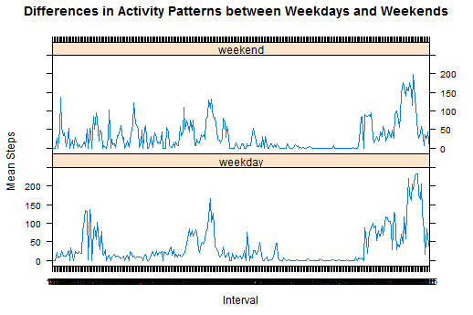

# Reproducible Research: Peer Assessment 1
### Basic settings


## Loading and preprocessing the data
```r
data <- read.csv("activity.csv", colClasses = c("integer", "Date", "factor"))
data$month <- as.numeric(format(data$date, "%m"))
noNA <- na.omit(data)
rownames(noNA) <- 1:nrow(noNA)
head(noNA)
```

```
##   steps       date interval month
## 1     0 2012-10-02        0    10
## 2     0 2012-10-02        5    10
## 3     0 2012-10-02       10    10
## 4     0 2012-10-02       15    10
## 5     0 2012-10-02       20    10
## 6     0 2012-10-02       25    10
```

```r
dim(noNA)
```
```
## [1] 15264     4
```


## What is mean total number of steps taken per day?
* Making a histogram: total number of steps taken each day
```r
ggplot(noNA, aes(date, steps)) + geom_bar(stat = "identity", colour = "steelblue", fill = "steelblue", width = 0.7) + facet_grid(. ~ month, scales = "free") + labs(title = "Histogram of Total Number of Steps Taken Each Day", x = "Date", y = "Total number of steps")
```

 

* Calculating and reporting the mean and median
1. Mean total number of steps taken per day:
```r
totalSteps <- aggregate(noNA$steps, list(Date = noNA$date), FUN = "sum")$x
mean(totalSteps)
```
```
## [1] 10766
```
1. Median total number of steps taken per day:
```r
median(totalSteps)
```
```
## [1] 10765
```


### What is the average daily activity pattern?
* Making a time series plot


```r
avgSteps <- aggregate(noNA$steps, list(interval = as.numeric(as.character(noNA$interval))), FUN = "mean")
names(avgSteps)[2] <- "meanOfSteps"

ggplot(avgSteps, aes(interval, meanOfSteps)) + geom_line(color = "steelblue", size = 0.8) + labs(title = "Time Series Plot of the 5-minute Interval", x = "5-minute intervals", y = "Average Number of Steps Taken")
```

 


* Which 5-minute interval, on average across all the days in the dataset, contains the maximum number of steps?

```r
avgSteps[avgSteps$meanOfSteps == max(avgSteps$meanOfSteps), ]
```

```
##     interval meanOfSteps
## 104      835       206.2
```


### Imputing missing values
* The total number of rows with NAs:

```r
sum(is.na(data))
```

```
## [1] 2304
```

* Devise a strategy 

* Creating a new dataset


```r
newData <- data 
for (i in 1:nrow(newData)) {
    if (is.na(newData$steps[i])) {
        newData$steps[i] <- avgSteps[which(newData$interval[i] == avgSteps$interval), ]$meanOfSteps
    }
}

head(newData)
```

```
##     steps       date interval month
## 1 1.71698 2012-10-01        0    10
## 2 0.33962 2012-10-01        5    10
## 3 0.13208 2012-10-01       10    10
## 4 0.15094 2012-10-01       15    10
## 5 0.07547 2012-10-01       20    10
## 6 2.09434 2012-10-01       25    10
```

```r
sum(is.na(newData))
```

```
## [1] 0
```

* Making a histogram 


```r
ggplot(newData, aes(date, steps)) + geom_bar(stat = "identity",
                                             colour = "steelblue",
                                             fill = "steelblue",
                                             width = 0.7) + facet_grid(. ~ month, scales = "free") + labs(title = "Histogram of Total Number of Steps Taken Each Day (no missing data)", x = "Date", y = "Total number of steps")
```

 


* these values differ from the estimates?

1. Mean total number of steps taken per day:

```r
newTotalSteps <- aggregate(newData$steps, 
                           list(Date = newData$date), 
                           FUN = "sum")$x
newMean <- mean(newTotalSteps)
newMean
```

```
## [1] 10766.19
```
1. Median total number of steps taken per day:

```r
newMedian <- median(newTotalSteps)
newMedian
```

```
## [1] 10766.19
```
1. Compare them with the two before imputing missing data:

```r
oldMean <- mean(totalSteps)
oldMedian <- median(totalSteps)
newMean - oldMean
```

```
## [1] 0
```

```r
newMedian - oldMedian
```

```
## [1] 1.188679
```
1. the new mean is the same as the old mean; the new median is greater than the old median.

### Are there differences in activity patterns between weekdays and weekends?

* Creating a new factor variable
```r
head(newData)
```

```
##     steps       date interval month
## 1 1.71698 2012-10-01        0    10
## 2 0.33962 2012-10-01        5    10
## 3 0.13208 2012-10-01       10    10
## 4 0.15094 2012-10-01       15    10
## 5 0.07547 2012-10-01       20    10
## 6 2.09434 2012-10-01       25    10
```

```r
newData$weekdays <- factor(format(newData$date, "%A"))
levels(newData$weekdays)
```

```
## [1] "Friday"    "Monday"    "Saturday"  "Sunday"    "Thursday"  "Tuesday"  
## [7] "Wednesday"
```

```r
levels(newData$weekdays) <- list(weekday = c("Monday", "Tuesday",
                                             "Wednesday", 
                                             "Thursday", "Friday"),
                                 weekend = c("Saturday", "Sunday"))
levels(newData$weekdays)
```

```
## [1] "weekday" "weekend"
```

```r
table(newData$weekdays)
```

```
## 
## weekday weekend 
##   12960    4608
```

* Making a panel plot


```r
weekdays <- c("Monday", "Tuesday", "Wednesday", "Thursday", 
              "Friday")
newData$dow = as.factor(ifelse(is.element(weekdays(as.Date(newData$date)),weekdays), "Weekday", "Weekend"))

meanbyweekday <- split(newData, newData$weekday)
meanbyweekday[[1]] <- aggregate(meanbyweekday[[1]][ , 1], 
                                list(meanbyweekday[[1]][ , 3]), mean, 
                                na.rm = TRUE)
meanbyweekday[[2]] <- aggregate(meanbyweekday[[2]][ , 1], 
                                list(meanbyweekday[[2]][ , 3]), mean, 
                                na.rm = TRUE)
meanbyweekday <- rbind(meanbyweekday[[1]], meanbyweekday[[2]])
meanbyweekday <- cbind(meanbyweekday, rep(c("weekday", "weekend"), each = 288))
names(meanbyweekday) <- c("interval", "meansteps", "weekday")
library(lattice)
xyplot(meansteps ~ interval | weekday, data = meanbyweekday, 
       type = "l", layout = c(1, 2), xlab = "Interval", ylab = "Mean Steps", 
       main = "Differences in Activity Patterns between Weekdays and Weekends")
```
 
